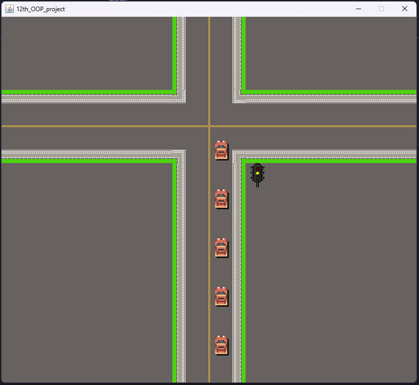
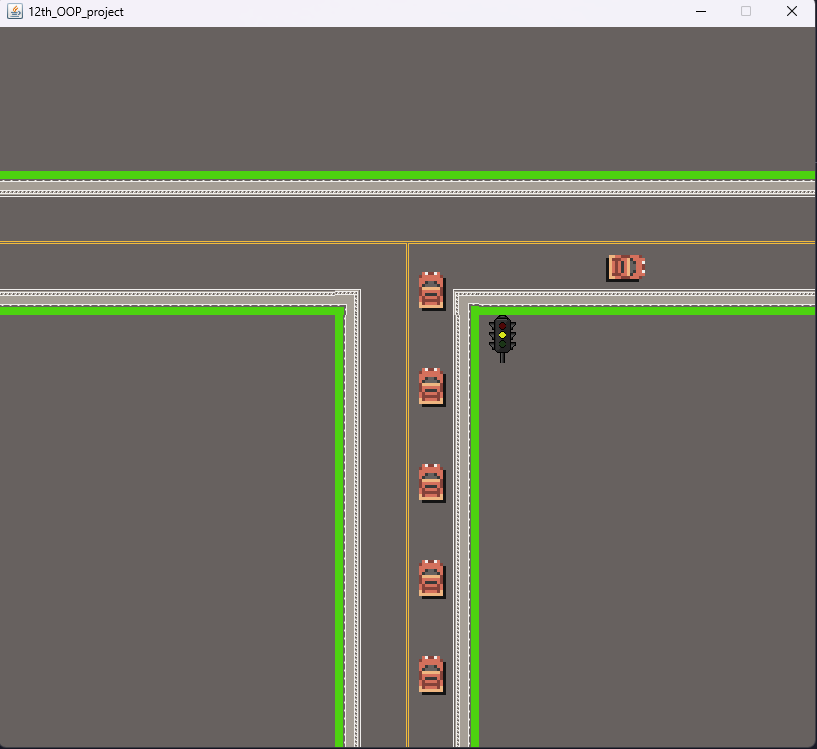
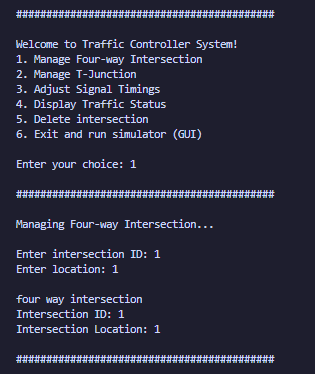
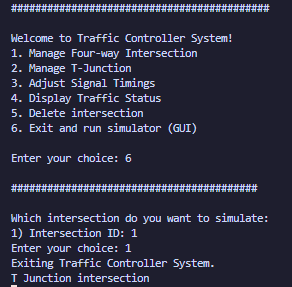

# Traffic Control Simulation System

A Java-based traffic management simulator that models intersections with configurable traffic lights, real-time vehicle movement, and a graphical interface. This project demonstrates object-oriented programming (OOP), multithreading, and Swing-based GUI development.

<div style="text-align: center;">
  
</div>

# 📌 Features
*1. Intersection Management*

1. Create & customize intersections (4-way and T-junctions)

2. Adjust traffic light timings (green, yellow, red) dynamically

3. Delete intersections from the system

4. Real-time status monitoring for all intersections

*2. Traffic Simulation*

1. Multi-threaded traffic light control (each intersection runs independently)

2. Vehicle movement that responds to traffic signals

3. Graphical visualization of traffic flow (using Java Swing)

*3. User Interface*

1. Console-based menu for managing intersections

2. Interactive GUI showing live traffic simulation

3. Dynamic updates when signal timings change

# 🛠️ Technologies Used

1. Java SE (Core Java, OOP concepts)

2. Java Swing (for GUI rendering)

3. Multithreading (for concurrent traffic light control)

4. File I/O (for loading map layouts)

# 🚀 How to Run

*Compile the project:*
```
javac mainprogram/originalmain.java
```

*Run the application:*
```
java mainprogram.originalmain
```

*Use the console menu to:*

1. Add intersections (4-way or T-junction)

2. Adjust traffic light timings

3. View traffic status

4. Launch the GUI simulation

📂 Project Structure
```
src/
├── mainprogram/                        # Core traffic control logic
|   |
│   ├── abs_traffic_control.java        # Abstract traffic control class
|   |
│   ├── Intersection.java               # Base intersection class
|   |
│   ├── four_way_Intersection.java      # 4-way intersection logic
|   |
│   ├── T_junction_intersection.java    # T-junction logic
|   |
│   ├── traffic_control.java            # Main controller
|   |
│   ├── TrafficLightSimulation.java     # Traffic light timing thread
|   |
│   └── originalmain.java               # Entry point (GUI setup)
│
└── mainGUI/                    # Graphical components
    ├── Entity/
    │   └── cars.java           # Vehicle movement logic
    ├── Gamepanel/
    │   └── game2.java          # Main simulation panel
    └── Tile_Manager/
        └── tilemanager.java    # Tile-based map rendering
```

# 🎯 Key Concepts Demonstrated

1. OOP Principles (Abstraction, Inheritance, Polymorphism)

2. Multithreading (Independent traffic light control)

3. Swing GUI (Interactive visualization)

4. File I/O (Loading map layouts from text files)

# GUI images

<div style="text-align: center;">
  
</div>

<div style="text-align: center;">
  
</div>

# Terminal images

<div style="text-align: center;">
  
</div>

<div style="text-align: center;">
  
</div>

